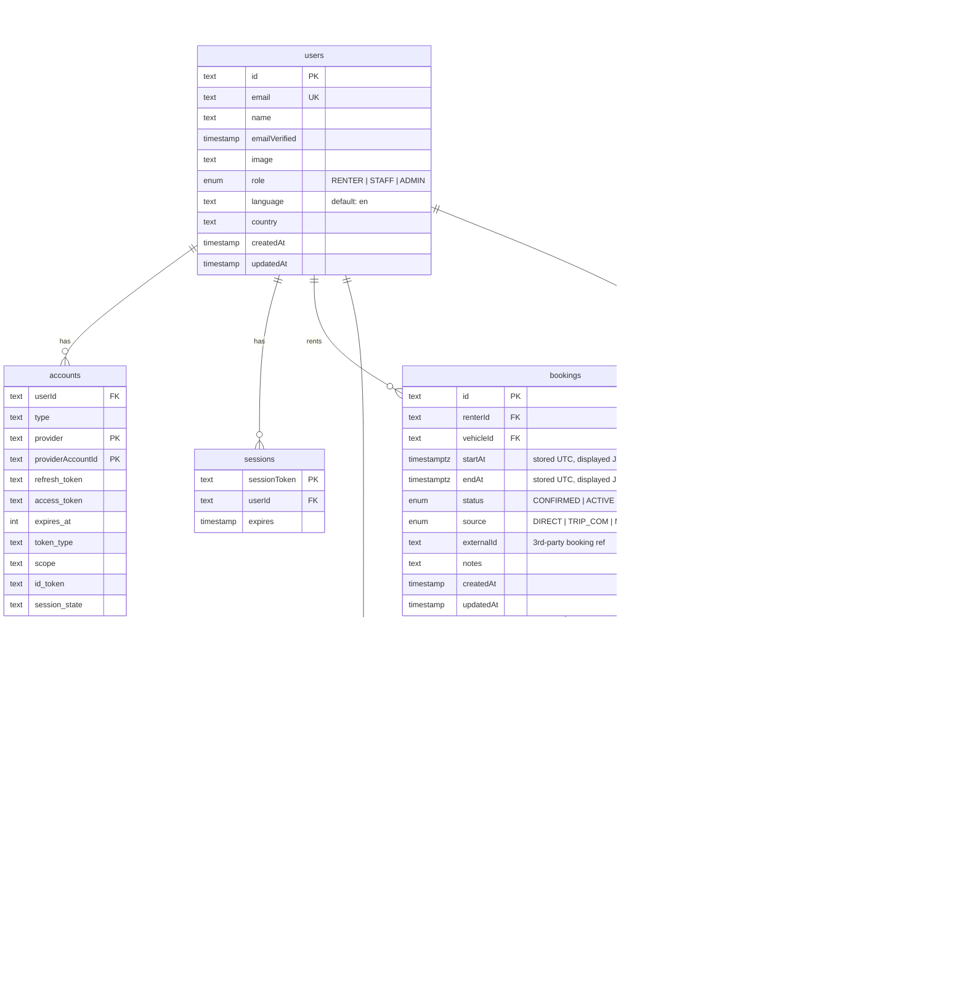
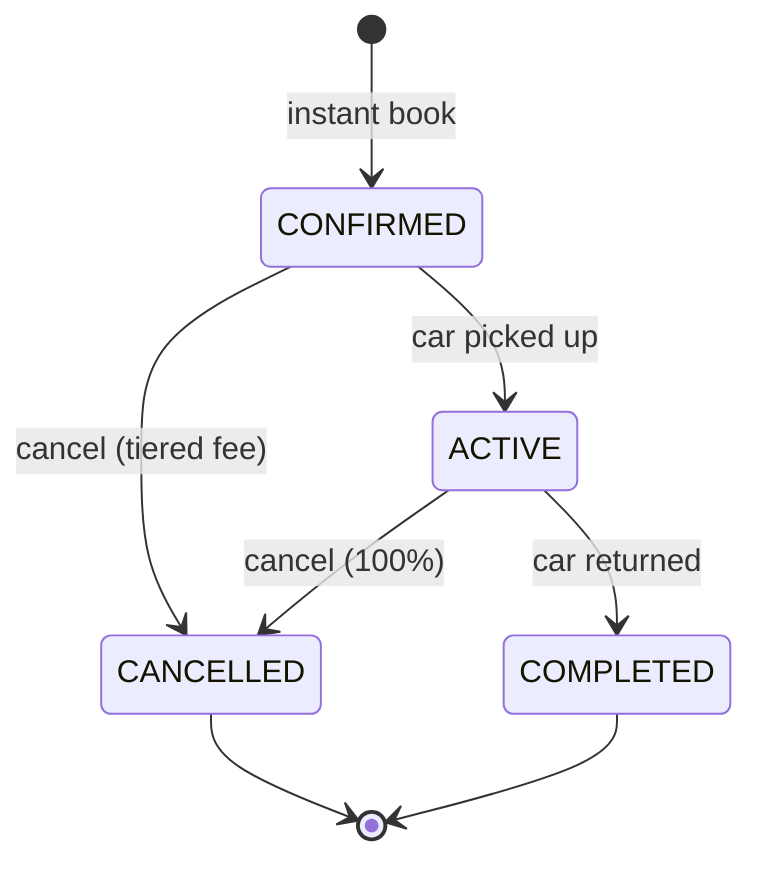
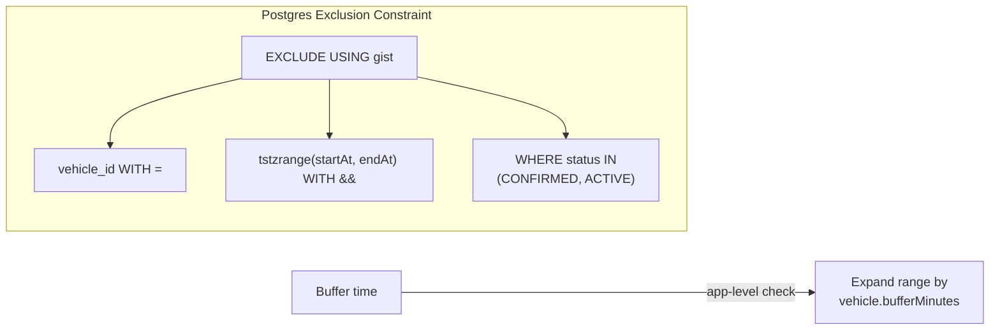

# Kuruma Rental — Entity Relationship Diagram

```mermaid
erDiagram
    %% Auth.js tables (existing)
    users {
        text id PK
        text email UK
        text name
        timestamp emailVerified
        text image
        enum role "RENTER | STAFF | ADMIN"
        text language "default: en"
        text country
        timestamp createdAt
        timestamp updatedAt
    }

    accounts {
        text userId FK
        text type
        text provider PK
        text providerAccountId PK
        text refresh_token
        text access_token
        int expires_at
        text token_type
        text scope
        text id_token
        text session_state
    }

    sessions {
        text sessionToken PK
        text userId FK
        timestamp expires
    }

    %% Phase 1: Core Booking
    vehicles {
        text id PK
        text name
        text description
        text[] photos "CF R2 URLs"
        int seats
        enum transmission "AUTO | MANUAL"
        text fuelType
        enum status "AVAILABLE | MAINTENANCE | RETIRED"
        int bufferMinutes "default: 60"
        int minRentalHours
        int maxRentalHours
        int advanceBookingHours
        timestamp createdAt
        timestamp updatedAt
    }

    bookings {
        text id PK
        text renterId FK
        text vehicleId FK
        timestamptz startAt "stored UTC, displayed JST"
        timestamptz endAt "stored UTC, displayed JST"
        enum status "CONFIRMED | ACTIVE | COMPLETED | CANCELLED"
        enum source "DIRECT | TRIP_COM | MANUAL | OTHER"
        text externalId "3rd-party booking ref"
        text notes
        timestamp createdAt
        timestamp updatedAt
    }

    %% Phase 2: Communication
    threads {
        text id PK
        text bookingId FK "optional"
        timestamp createdAt
        timestamp updatedAt
    }

    thread_participants {
        text threadId FK "composite PK"
        text userId FK "composite PK"
        int unreadCount "default: 0"
    }

    messages {
        text id PK
        text threadId FK
        text senderId FK
        text content
        text sourceLanguage "auto-detected"
        jsonb translations "cached, keyed by lang"
        timestamp createdAt
    }

    %% Relationships
    users ||--o{ accounts : "has"
    users ||--o{ sessions : "has"
    users ||--o{ bookings : "rents"
    vehicles ||--o{ bookings : "booked for"
    bookings |o--o| threads : "may have"
    threads ||--o{ thread_participants : "has"
    threads ||--o{ messages : "contains"
    users ||--o{ thread_participants : "participates"
    users ||--o{ messages : "sends"
```

## Booking State Machine

```mermaid
stateDiagram-v2
    [*] --> CONFIRMED: instant book
    CONFIRMED --> ACTIVE: car picked up
    CONFIRMED --> CANCELLED: cancel (tiered fee)
    ACTIVE --> COMPLETED: car returned
    ACTIVE --> CANCELLED: cancel (100%)
    CANCELLED --> [*]
    COMPLETED --> [*]
```

## Scheduling Constraint

```mermaid
flowchart LR
    subgraph "Postgres Exclusion Constraint"
        A["EXCLUDE USING gist"] --> B["vehicle_id WITH ="]
        A --> C["tstzrange(startAt, endAt) WITH &&"]
        A --> D["WHERE status IN\n(CONFIRMED, ACTIVE)"]
    end
    E["Buffer time"] -->|"app-level check"| F["Expand range by\nvehicle.bufferMinutes"]
```
